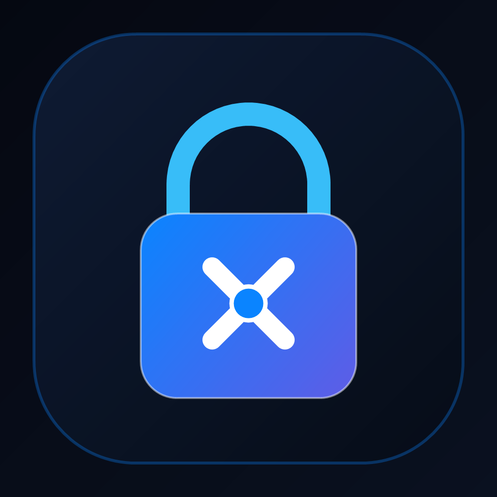

# 🛡️ LockX — iOS 18 Security Vault & App Protection

<p align="center">
  
</p>

<p align="center">
  <b>Ứng dụng Két Sắt Mật Khẩu, Quản Lý Tệp Tin & Thẻ Hội Viên 3D Chuẩn Apple iOS 18 Human Interface Guidelines</b>
</p>

<p align="center">
  
  
  
  
  
</p>

---

## 📖 Giới Thiệu (Overview)

**LockX** là ứng dụng bảo mật di động thế hệ mới được xây dựng bằng **React Native** & **Expo SDK 57**, lấy cảm hứng từ ngôn ngữ thiết kế **Apple iOS 18 HIG** sang trọng, mượt mà và tinh tế.

Ứng dụng tích hợp toàn diện giữa **Két sắt quản lý mật khẩu mã hóa quân đội AES-256**, **Hệ thống bảo vệ ứng dụng (App Shield)**, **Quản lý tệp tin bảo mật & tải xuống**, cùng **Bộ sưu tập Thẻ Hội Viên 3D (VIP 3D Cards)** với hiệu ứng ánh kim holographic quét tia sáng laser 60fps/120fps.

---

## ✨ Tính Năng Mới & Nổi Bật (Latest Features)

### 1. 💳 Bộ Sưu Tập Thẻ VIP 3D Đa Cấp Độ (3D VIP Cards Collection)
Hệ thống thẻ hội viên 3D trực quan với hiệu ứng chiều sâu **3-Card Peek Carousel**: thẻ chính ở giữa, đuôi thẻ trái và đầu thẻ phải nhô ra 2 bên, hỗ trợ vuốt cảm ứng mượt mà và chuyển đổi tức thì không gián đoạn:

* **🥈 Bạch Kim Titan (Silver Elite)** — *3 đặc quyền cơ bản:*
  1. Mã hóa cơ sở dữ liệu AES-256 GCM quân đội chống bẻ khóa từ điển.
  2. Lưu trữ két sắt đám mây Cloud Vault 50GB tốc độ cao.
  3. Tự động đồng bộ 3 thiết bị thời gian thực (iPhone, iPad, Laptop).

* **👑 Vàng Đúc Hoàng Gia (Gold 24K)** — *5 đặc quyền quý tộc:*
  1. Toàn bộ đặc quyền của thẻ Bạch Kim.
  2. Mở khóa Giao diện toàn nền nhung đen mạ vàng Hoàng Gia (Gold Luxury Theme).
  3. Bộ Icon ứng dụng SVG đúc vàng 24K độc quyền cho màn hình chính.
  4. Nâng cấp dung lượng Cloud Vault 200GB siêu tốc.
  5. Đồng bộ không giới hạn số lượng thiết bị với độ trễ dưới 0.1s.
  6. Tường lửa tự động chống dò quét Wi-Fi công cộng tại quán cafe/sân bay.

* **💎 Kim Cương Lam (Diamond Imperial)** — *7 đặc quyền lượng tử:*
  1. Toàn bộ đặc quyền của thẻ Vàng Hoàng Gia.
  2. Thuật toán mã hóa kháng máy tính lượng tử thế hệ mới (Post-Quantum Cryptography).
  3. Mở khóa bộ đôi chủ đề Vũ trụ Nebula & Cyber Neon Matrix phát quang.
  4. Không gian két sắt Cloud 1TB (1000GB) cho tài liệu tuyệt mật.
  5. Băng thông máy chủ ưu tiên Dedicated 10Gbps tải lên tức thì.
  6. Tính năng chống chụp màn hình & chặn sniffer quay lén tự động làm đen màn hình.
  7. Quét Dark Web Monitor thời gian thực cảnh báo ngay khi email/mật khẩu bị lộ.
  8. Đường dây nóng bảo mật VIP Concierge 1-1 phục vụ 24/7.

* **🛡️ Black Titanium VIP (Tối Thượng - Không Màu Vàng)** — *9 đặc quyền Stealth bí mật:*
  1. Toàn bộ đặc quyền của thẻ Kim Cương.
  2. Thiết kế đen mờ phay xước công nghệ stealth quân sự độc bản (`#0A0C10`, `#CBD5E1`).
  3. Kiến trúc bảo mật Zero-Knowledge tuyệt đối (chỉ người dùng giữ chìa khóa).
  4. Dung lượng lưu trữ Cloud 2TB không giới hạn định dạng.
  5. Chế độ tàng hình Covert Mode: đóng băng app và ẩn danh tức thì khi nhập mã cứu hộ.
  6. Miễn nhiễm trước các cuộc tấn công trung gian Man-in-the-Middle (MITM).
  7. Hỗ trợ xác thực khóa phần cứng vật lý qua cổng USB-C / NFC (FIDO2 / YubiKey).
  8. Chuyên viên an ninh mạng tư vấn cấu hình an toàn cá nhân 1-1 định kỳ.
  9. Bẫy chụp ảnh kẻ xâm nhập Intruder Trap qua camera trước kèm tọa độ GPS.
  10. Kịch bản tự hủy dữ liệu khẩn cấp Self-Destruct sau 10 lần nhập sai mật khẩu.

* **☢️ Super Card Pro Max Uranium (Tối Hậu - Neon Green `#39FF14`)** — *12 đặc quyền vô hạn:*
  1. Toàn bộ đặc quyền của thẻ Black Titanium.
  2. Thẻ phát quang lõi năng lượng Uranium 235 rực sáng xanh huỳnh quang neon.
  3. Dung lượng két sắt vô hạn (Unlimited Cloud Vault) vĩnh cửu.
  4. Siêu mã hóa lượng tử đa chiều Q-Shield Matrix bất khả xâm phạm trong 100 năm tới.
  5. Mở khóa trọn đời tất cả theme VIP, 8+ icon cao cấp và giao diện tương lai.
  6. Hệ thống phòng thủ AI chủ động tự trị cách ly và triệt tiêu mã độc tức thì.
  7. Đồng bộ lượng tử 0.01 giây qua cụm máy chủ chuyên dụng.
  8. Định tuyến ẩn danh đa tầng 5 lớp IP qua 5 quốc gia trung lập.
  9. Két sắt ảo đánh lạc hướng (Decoy Vault) chứa dữ liệu giả mạo khi bị ép mở khóa.
  10. Tín hiệu SOS cứu trợ khẩn cấp toàn cầu kèm vị trí trực tiếp tới người thân.
  11. Chứng nhận khắc tên sở hữu lên chuỗi khối Blockchain ID phi tập trung.
  12. Danh vị Hội Viên Tối Cao Vĩnh Cửu (Lifetime Master) miễn phí trọn đời mọi bản cập nhật.

---

### 2. 🌟 Hiệu Ứng Ánh Kim Holographic & Chuyển Đổi 60FPS
* **Holographic Shimmer Beam:** Vệt sáng kim loại phản chiếu đa lớp (Lõi trắng ngọc `rgba(255,255,255,0.55)`, tia laser `#FFFFFF` và hào quang Ambient Glow) quét liên tục tuần hoàn trên tất cả các thẻ mà không bị gián đoạn khi chuyển trang.
* **Sparkle Glitter Glints:** Đính các vì sao 4 cánh phát quang tinh tế tại góc thẻ mô phỏng ánh phản xạ kim loại thực thụ.
* **Thao tác chuyển thẻ linh hoạt:**
  * Bấm nút mũi tên trái/phải ($<$ và $>$).
  * Vuốt cảm ứng hoặc kéo chuột trực quan.
  * Chạm trực tiếp vào phần thẻ nhô ra ở 2 bên để bay tới thẻ đó.
  * Bấm thanh 5 chấm chỉ báo (Dots) bên dưới.
  * Khắc phục triệt để hiện tượng giật khung hình 1-frame ("bị giật 1 cái") nhờ kiến trúc `requestAnimationFrame` và giữ cố định phần tử DOM thẻ.

---

### 3. 🎨 Bộ Icon Ứng Dụng Vector SVG & Theme Nền Toàn Diện
* **Biểu tượng ứng dụng (App Icons):**
  * Loại bỏ hoàn toàn emoji, chuyển sang 100% hình họa vector SVG cao cấp: *Sapphire Original, Royal Gold 24K, Cyberpunk Matrix, Nebula Deep, Emerald Shield, Ruby Luxury, Obsidian Stealth, Black Titanium*.
* **Chủ đề màu nền toàn diện (VIP Themes):**
  * Đổi màu nền toàn bộ ứng dụng (Background tint), không chỉ đổi màu chữ:
    * 🌑 **Mặc định (iOS Dark / Light)**
    * 👑 **Gold Luxury** (Nền đen nhung viền vàng quý tộc)
    * ⚡ **Cyberpunk Neon** (Nền xanh đen ma trận neon phát quang)
    * 🌌 **Nebula Universe** (Nền tím tinh vân vũ trụ sâu thẳm)
    * 🖤 **OLED Pure Black** (Đen tuyền 100% tối ưu pin màn hình OLED)

---

### 4. 📂 Quản Lý Tệp Tin & Tải Xuống Bảo Mật (LockX Files)
* **Trình tải xuống tệp tin:** Nhập URL trực tiếp để tải tài liệu, video, hình ảnh an toàn vào bộ nhớ nội bộ két sắt.
* **Phân loại tệp thông minh:** Bộ lọc Hình ảnh, Video, Tài liệu, Âm thanh, Tệp nén.
* **Thùng rác an toàn (Recently Deleted):** Lưu trữ tệp tin và tài khoản đã xóa với tính năng khôi phục hoặc dọn sạch vĩnh viễn.

---

### 5. ☁️ Gói Dung Lượng Đám Mây Chuẩn Apple iCloud+
* Các gói nâng cấp bộ nhớ: **5GB (Miễn phí)**, **50GB**, **200GB**, **2TB**.
* Tích hợp quy trình tạo đơn hàng tự động kèm mã QR thanh toán ngân hàng chuyển khoản bảo mật.

---

### 6. 🗄️ Két Sắt Mật Khẩu (Password Vault)
* Lưu trữ tài khoản, mật khẩu, máy chủ, ghi chú với mã hóa an toàn.
* Sao chép tài khoản, mật khẩu 1 chạm với thông báo Dynamic Island Toast rơi từ đỉnh màn hình.
* Phân loại mục: Trò chơi, Mạng xã hội, Công việc, Thẻ ngân hàng.

---

### 7. 📱 Bảo Vệ Ứng Dụng & Screen Time
* Danh sách khóa ứng dụng nhạy cảm (Ngân hàng, Zalo, Messenger, Tin nhắn...).
* Biểu đồ thời gian sử dụng màn hình Screen Time trực quan theo giờ và theo tuần.
* Hỗ trợ URL Schemes gọi mở ứng dụng tức thì.

---

### 8. 🌐 Đa Ngôn Ngữ Năng Động (Dynamic i18n)
Chuyển đổi ngôn ngữ tức thì trong ứng dụng không cần tải lại:
* 🇻🇳 **Tiếng Việt** (Mặc định)
* 🇺🇸 **English** (Tiếng Anh)
* 🇰🇷 **한국어** (Tiếng Hàn)
* 🇨🇳 **中文** (Tiếng Trung)
* 🇯🇵 **日本語** (Tiếng Nhật)
* 🇫🇷 **Français** (Tiếng Pháp)
* 🇩🇪 **Deutsch** (Tiếng Đức)

---

## 🛠️ Công Nghệ Sử Dụng (Tech Stack)

| Thành phần | Công nghệ / Thư viện | Phiên bản |
| :--- | :--- | :--- |
| **Framework** | React Native (Expo) | Expo SDK 57 / RN 0.86 |
| **Language** | TypeScript | 6.0.x |
| **Icons & Vectors** | `react-native-svg` & `@expo/vector-icons` | 15.x / 14.x |
| **Animation Engine** | React Native Animated + Easing GPU acceleration | Core |
| **Storage** | `@react-native-async-storage/async-storage` | 2.2.x |
| **Biometrics** | `expo-local-authentication` (Face ID / Touch ID) | 57.0.x |
| **Device & Sensor** | `expo-device`, `expo-network` | 57.0.x |
| **Backend & Webhooks** | PHP 8.x + MySQL + Telegram Bot Webhooks | 1.0.0 |
| **CI/CD** | GitHub Actions (Xcode, macOS-latest) | v4 |

---

## 📁 Cấu Trúc Thư Mục (Project Structure)

```text
LockX/
├── .github/
│   └── workflows/
│       └── build-ios.yml       # Quy trình đóng gói tự động file iOS IPA trên macOS runner
├── assets/                     # Biểu tượng app, hình ảnh thẻ, bánh xe may mắn
├── webphp/                     # Máy chủ phụ trợ PHP API & Telegram Webhook
│   ├── admin.php               # Bảng điều khiển quản trị viên
│   ├── api/                    # API thông báo đẩy, đổi mật khẩu, webhook
│   └── config/database.php     # Kết nối cơ sở dữ liệu
├── App.tsx                     # Trung tâm mã nguồn ứng dụng (State, UI, Carousel 3D, HIG)
├── index.ts                    # Entry point đăng ký ứng dụng Expo
├── app.json                    # Cấu hình Bundle ID (com.lockx.app), Face ID permissions
├── package.json                # Danh sách gói phụ thuộc và scripts
├── tsconfig.json               # Cấu hình TypeScript
└── README.md                   # Tài liệu hướng dẫn dự án
```

---

## 🚀 Hướng Dẫn Cài Đặt & Chạy Ứng Dụng (Getting Started)

### 1. Yêu cầu hệ thống (Prerequisites)
* **Node.js**: Phiên bản 18.x hoặc 20.x LTS.
* **npm** hoặc **yarn**.
* **Expo Go** trên điện thoại (iOS / Android) hoặc trình duyệt Web.

### 2. Cài đặt các gói phụ thuộc
```bash
# Clone repository về máy
git clone https://github.com/tuanquayhuok/LockX.git

# Di chuyển vào thư mục dự án
cd LockX

# Cài đặt thư viện
npm install
```

### 3. Khởi chạy ứng dụng (Development)
```bash
# Khởi động Expo Metro Bundler
npx expo start

# Hoặc mở trực tiếp trên nền tảng mong muốn:
npm run ios       # Chạy trên máy ảo iOS Simulator (yêu cầu macOS & Xcode)
npm run android   # Chạy trên Android Emulator hoặc thiết bị thật qua ADB
npm run web       # Chạy trên trình duyệt Web (Chrome / Safari)
```

---

## 📦 Đóng Gói File Cài Đặt iOS (.IPA)

Dự án đã tích hợp sẵn GitHub Actions workflow tại `.github/workflows/build-ios.yml`:

1. Vào tab **Actions** trên GitHub repository: [`LockX Actions`](https://github.com/tuanquayhuok/LockX/actions).
2. Chọn workflow **📱 Build iOS IPA**.
3. Bấm nút **Run workflow** -> Chọn nhánh `main` và bấm xác nhận.
4. Quá trình build sẽ tự động biên dịch mã nguồn qua Xcode trên runner `macos-latest` và xuất file `LockX.ipa` trong mục **Artifacts** để tải về.
5. Cài đặt file IPA lên iPhone thông qua các công cụ sideload phổ biến:
   * **AltStore**
   * **Sideloadly**
   * **TrollStore** (nếu thiết bị có hỗ trợ)

---

## 🔒 Bản Quyền & Giấy Phép (License)

Dự án được phân phối dưới giấy phép **MIT License**. Bạn có toàn quyền sử dụng, phát triển và tùy biến cho mục đích cá nhân hoặc thương mại.

<p align="center">Made with ❤️ for iOS Security, Design & Luxury Enthusiasts.</p>
